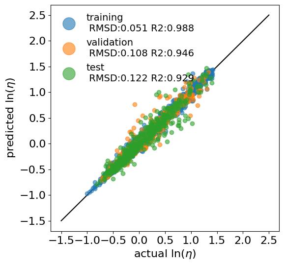
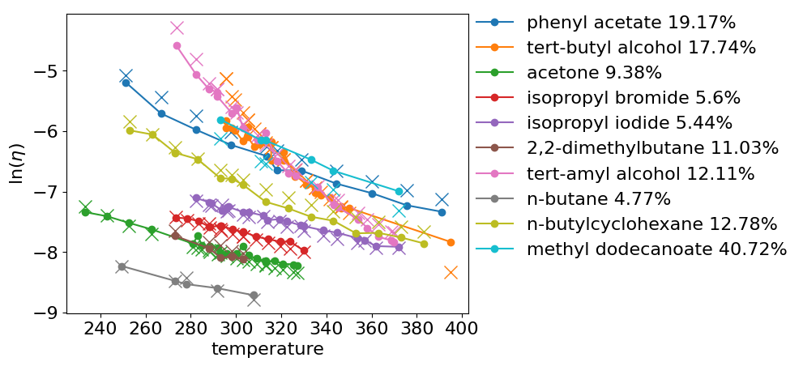

# comment-deep-eyring-architecture

### Code for Comment on Paper: 
## Advancing material property prediction: using physics-informed machine learning models for viscosity

The Code enables reproducing the best performing model from the comment.
It also allows you to build and train your own models. A more detailed documentation and support is available on request. 

If you are using model, code and/or data, please cite:

#### OUR COMMENT/ WORK

as well as the original paper because our work would not have been possible without the extensie dataset and insights provided by Chew et.al.


```
@article{chew2024advancing,
         title     = {Advancing material property prediction: using physics-informed machine learning models for viscosity},
         author    = {Chew, Alex K and Sender, Matthew and Kaplan, Zachary and Chandrasekaran, Anand and Chief Elk, Jackson and Browning, Andrea R and Kwak, H Shaun and Halls, Mathew D and Afzal, Mohammad Atif Faiz},
         journal   = {J Cheminform},
         volume    = {16},
         pages     = {31},
         year      = {2024},
}
```

### Model

the best perfoming model can be found in train30 and is the one shown in our comment paper. 

We want to point out the following TECHNICAL NOTES:

- SAGE Pooling leads to best model performance on most train/test/val splits
- GraphConv Pooling leads to lower variance between train/test/val splits i.e. might be easier to train
- when trained on MD features:
	- eyring parameters may vary for different temperatures because they are informed about the state points via MD features 
	- ...but not about temperature directly
	- MD features might be noisy which could propagate into the predictions and/or favor overfitting
- atom features seem to play a minor role when system information is available in the form of MD features


The overall RMSD and R2 metrics are good:



...as well as good predictive capabilities with low MEADs on the the test data:




